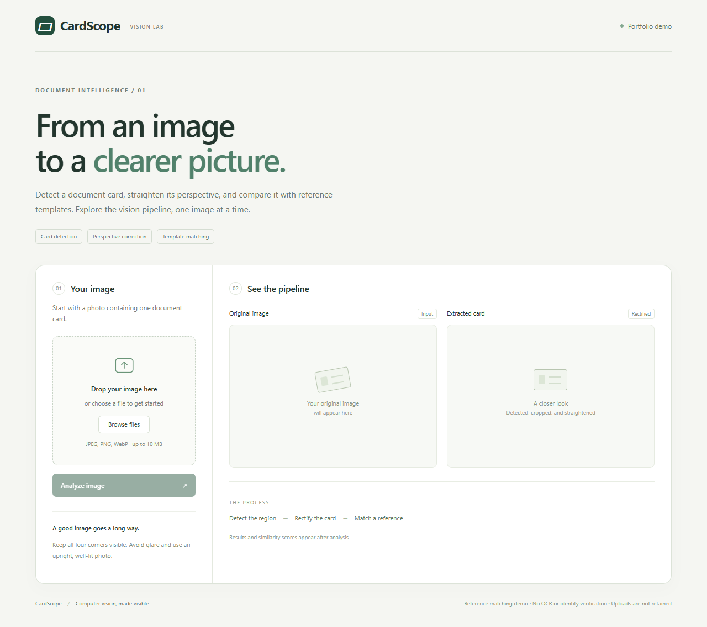
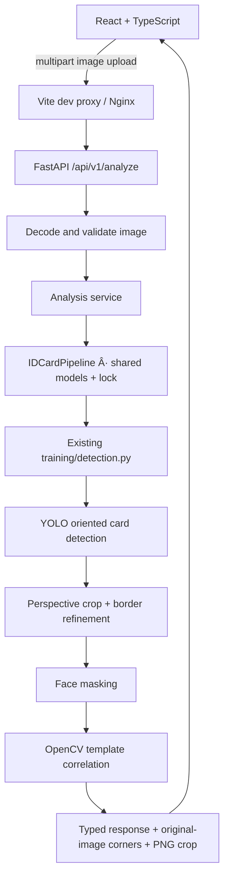

# CardScope · Document vision lab

A small computer vision application that turns trained card-detection weights
into an interactive upload → detection → extraction → reference-matching workflow.
Built as an AI / Computer Vision Engineer portfolio project.



Photographs of cards contain background clutter and perspective distortion.
CardScope locates a card, rectifies it, and checks whether its appearance matches
one of the supplied reference images. It exposes intermediate images and scores
so both successful and unsuccessful predictions can be inspected.

This is a reference-matching demo, not an identity-verification or production KYC
system. It does not perform OCR or validate document authenticity.

## Functionality

- Drag-and-drop or browse for a JPEG, PNG, or still WebP image.
- Validate actual image contents, upload size, and decoded pixel count.
- Detect the first card OBB, crop it, and refine its border using the existing pipeline.
- Display the original image with its detected polygon and the rectified card.
- Compare a face-masked input card against ten pre-masked reference templates.
- Show YOLO detection confidence separately from normalized template correlation.
- Report matched, unmatched, no-detection, and extraction-failure outcomes.
- Return structured errors for invalid uploads and inference failures.
- Load models and references once per application process; serialize model calls.

Uploads are not retained by the application. Multipart parsing/proxying may use
temporary files that are closed after the request. Images and extracted cards
are not logged. There is no database or upload history.

## Architecture



The backend's small `Pipeline` protocol is the runtime boundary. An ONNX adapter
could implement it later without changing HTTP endpoints or the frontend. No
model conversion or retraining was performed for the application.

## Models and preserved inference behavior

| Asset | Role |
| --- | --- |
| `training/model/yolov8s-detect.pt` | YOLO OBB card detector; class `card` |
| `training/model/yolov8n-face.pt` | Face pose model; only its face bounding boxes are used |
| `training/template_samples/Template 0.jpg` … `Template 9.jpg` | Pre-masked reference images |

The checkpoint filenames do not fully describe their model tasks. Startup checks
the actual loaded tasks and fails clearly for missing/incompatible assets or an
empty template directory. Model paths are checked before invoking YOLO, preventing
automatic substitution/download of missing weights.

The training CLI and backend share one original-image pipeline:

```text
Full-resolution RGB input -> first YOLO OBB -> expanded temporary crop
-> resize temporary crop to 600 x 400 -> edge/Hough border refinement
-> map refined corners back to the original image
-> warp original pixels directly to 600 x 400
-> face masking -> downsample to 300 x 200 -> normalized template correlation -> strict score > 0.8
```

Reference templates are normalized to 600 x 400, then downsampled once to
300 x 200 with INTER_AREA. The masked query uses the same downsampling.
The returned card stays 600 x 400. Sizes are width by
height. YOLO performs its own internal input preparation; the API no longer
resizes the whole uploaded image before detection.

The input face boxes are expanded by 30% and blacked out for matching. Returned
card images retain the face. Reference images are loaded directly without running
the face model again. Template IDs are filenames and display names are file stems;
the service binds each identity to its array using one directory listing, retaining
existing tie-breaking order. There are no verified document-type names.

The API retains the existing RGB NumPy inputs even though [Ultralytics documents BGR for
NumPy sources](https://docs.ultralytics.com/modes/predict/). Correcting that convention
is deferred because it could change results.
Original-preview geometry accounts for EXIF orientation without changing the
pixels sent into inference. Coordinates describe the refined card boundary when available, or the initial
OBB when extraction fails. No fallback crop is substituted when refinement fails.

## Project structure

```text
backend/
  app/
    main.py                  # Lifespan loading and error handling
    config.py                # Environment-based configuration
    api/                     # Endpoints and request-body limit
    schemas/                 # Pydantic response models
    services/                # Decode, coordinate mapping, image encoding
    inference/               # Existing-runtime adapter
  tests/                     # API and adapter tests
  smoke.py                   # Real-weight parity check
  requirements*.txt
  constraints.txt            # Tested dependency versions
  Dockerfile
frontend/
  src/                       # React UI, API client, response types, tests
  Dockerfile
  nginx.conf
training/                    # Existing training, inference, assets, tests
docker-compose.yml
```

## Run with Docker

Prerequisites: Docker with Compose, running Docker Desktop on Windows/macOS, and
the model/reference files listed above. Training remains independent; its
`training/docker.sh` is not used or modified by this application.

From the repository root:

```sh
docker compose up --build
```

- Application: http://localhost:8080
- API documentation: http://localhost:8000/docs
- Health: http://localhost:8000/api/v1/health

Compose mounts weights and templates read-only. They are not baked into the API
image. The backend targets Linux amd64 with Python 3.12 and pinned official CPU
PyTorch wheels, with one Uvicorn worker. ARM hosts use Docker's amd64 emulation;
native ARM wheels/image configuration are not included in this first version.
The frontend builds with Node and serves static assets through Nginx; `/api` is
proxied to the backend, so no permissive CORS configuration is needed.

The first build downloads PyTorch and other dependencies and can take several
minutes. The frontend starts after the backend health check passes. To inspect
startup failures or stop the application:

```sh
docker compose logs backend
docker compose down
```

## Local development

Use Python 3.12 and Node 22 (or a supported newer LTS release). Run backend commands
from the repository root so `backend` and `training` imports resolve.

Windows PowerShell, without activating the virtual environment:

```powershell
python -m venv .venv
.\.venv\Scripts\python.exe -m pip install -r backend/requirements-dev.txt
.\.venv\Scripts\python.exe -m uvicorn backend.app.main:app --host 127.0.0.1 --port 8000
```

Linux/macOS:

```sh
python3.12 -m venv .venv
.venv/bin/python -m pip install --no-deps -c backend/constraints.txt torch torchvision --index-url https://download.pytorch.org/whl/cpu
.venv/bin/python -m pip install -r backend/requirements-dev.txt
.venv/bin/python -m uvicorn backend.app.main:app --host 127.0.0.1 --port 8000
```

In another terminal:

```sh
cd frontend
npm ci
npm run dev
```

Open http://localhost:5173. On PowerShell systems that block `npm.ps1`, use
`npm.cmd` in place of `npm`. Vite proxies API requests to `127.0.0.1:8000`.
The local `.venv` and `node_modules` are development dependencies, not Docker inputs.

## Configuration

Copy `.env.example` to `.env` for local overrides, or set environment variables.
Defaults resolve assets relative to the repository, not the current directory.
Compose supplies its own asset paths and serving defaults in `docker-compose.yml`.

| Variable | Default |
| --- | --- |
| `IDCARD_DETECTOR_PATH` | `training/model/yolov8s-detect.pt` |
| `IDCARD_FACE_MODEL_PATH` | `training/model/yolov8n-face.pt` |
| `IDCARD_TEMPLATE_DIR` | `training/template_samples` |
| `IDCARD_DEVICE` | `cpu` |
| `IDCARD_MATCH_THRESHOLD` | `0.8` |
| `IDCARD_MAX_UPLOAD_BYTES` | `10485760` (10 MiB) |
| `IDCARD_MAX_IMAGE_PIXELS` | `20000000` |

If changing the upload limit, also align the UI's file limit and Nginx's body
limit (which includes multipart overhead). The current Docker image targets CPU;
GPU serving would require a different wheel/container setup. More Uvicorn workers
would each load another model copy.

## API

### `GET /api/v1/health`

Returns readiness and template count. The service fails startup if model loading
fails; an uninitialized service returns HTTP 503 rather than claiming readiness.

### `POST /api/v1/analyze`

Accepts `multipart/form-data` with an image in the `file` field. Actual image
decoding determines validity; a filename or declared MIME type is not trusted.

```sh
curl -F "file=@training/test_images/image6.png" http://localhost:8000/api/v1/analyze
```

On Windows use `curl.exe`. Normal CV outcomes return HTTP 200:

| `status` | Meaning |
| --- | --- |
| `matched` | Extracted card matched a reference above the threshold |
| `no_template_match` | Card extracted; no score exceeded the threshold |
| `no_card_detected` | Detector did not return an OBB |
| `extraction_failed` | Card detected; crop or border refinement failed |

The response includes `card_detected`, `template_id`, `template_name`,
`detection_confidence`, `match_score`, `match_threshold`, `is_supported`,
`corners`, `image_width`, `image_height`, `extracted_card`, `failure_stage`,
`processing_time_ms`, and `inference_time_ms`.

- `is_supported` is `null` when classification was not reached. It means a
  reference matched, not that a legal document type was verified.
- `match_score` is correlation in `[-1, 1]`, not a calibrated probability.
- `extracted_card` is a PNG data URL or `null`; the browser retains the original.
- Corners use pixel coordinates in the EXIF-oriented original preview.
- Processing time covers decoding, waiting for the shared model, inference,
  and crop encoding. It excludes upload transfer and response transmission.
- Inference time is the existing pipeline's wall time, excluding lock wait.

Errors use `{"error":{"code":"invalid_image","message":"..."}}`.
HTTP 413 means a byte/pixel limit was exceeded, 415 an unsupported image format,
422 missing/invalid input, 503 not ready, and 500 an unexpected inference error.
Responses are marked `Cache-Control: no-store`. Request bodies are bounded even
when sent without a Content-Length header.

## Validation and example results

Windows commands from the root (substitute `.venv/bin/python` on Linux/macOS):

```powershell
.\.venv\Scripts\python.exe -m unittest discover -s training -p 'test*extraction.py' -v
.\.venv\Scripts\python.exe -m unittest discover -s training -p test_detection.py -v
.\.venv\Scripts\python.exe -m pytest backend/tests -q
.\.venv\Scripts\python.exe -m backend.smoke
```

Frontend:

```sh
cd frontend
npm test
npm run build
```

With Compose running, `npm run test:e2e` in `frontend/` runs a real-upload browser
check and saves desktop/mobile screenshots in `artifacts/browser/`. The default
Playwright configuration uses installed Microsoft Edge in headless mode. If Edge
is unavailable, install Playwright Chromium and change `channel` in
`frontend/playwright.config.ts` to `chromium`.

Unit tests use mocked models for deterministic outcomes. The separate real-weight
smoke check compares training and serving inference labels and crop pixels, then
exercises response encoding. It writes local crops and JSON to ignored
`artifacts/smoke/`. Those artifacts may contain document information; they are
not bundled into the frontend.

With original-image extraction and the corrected references, the supplied
samples produced these local CPU smoke-test results:

| Sample | Similarity | Result at `score > 0.8` |
| --- | --- | --- |
| `image553.png` | 0.836657 | Matched Template 5 |
| `image6.png` | 0.867860 | Matched Template 0 |

These results use 300 x 200 matching. The 0.8 threshold is unchanged; validation
on incorrect/nonmatching cards is deferred.
These are two sample observations, not an accuracy evaluation or a latency
benchmark. Border refinement can still select an inner line and clip content;
the coordinate mapping preserves the selected boundary rather than correcting it.

## Limitations and future work

- Only the first detected card is processed; multi-card selection is deferred.
- Fixed resizing, color conventions, and border-refinement failures are preserved.
- Reference correlation is sensitive to lighting, orientation, masking, and alignment.
- No match can mean a poor image of a reference card, not necessarily an unknown type.
- References were collected online; document names and redistribution permissions
  have not been verified. Check the source assets before publishing a public demo.
- Smoke-test parity does not establish whether the reference images' colors were
  prepared correctly. Compare against source images before changing color handling.
- CPU execution is serialized for this small demo; it is not a high-throughput service.
- Future work: controlled aspect-ratio/color experiments, a labeled evaluation set,
  threshold calibration, verified template metadata, OCR, and ONNX Runtime profiling.

For dataset preparation and training, see [training/README.md](training/README.md).
Model lifecycle uses FastAPI's [lifespan mechanism](https://fastapi.tiangolo.com/advanced/events/).
